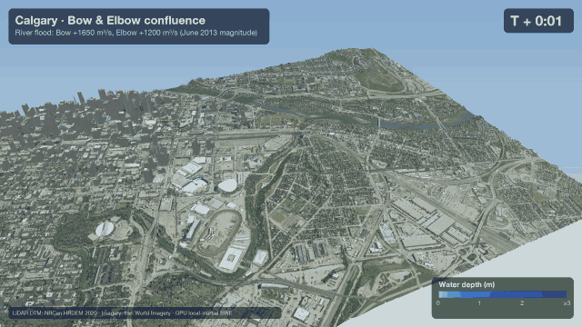

# Calgary Flood Simulation

GPU flash-flood simulation of Calgary's Bow / Elbow river confluence, rendered as a 3D animation over LiDAR terrain and aerial imagery.



- **Model** (`sim.py`): local-inertial shallow-water equations (Bates et al. 2010) in PyTorch, runs on CUDA, Apple MPS or CPU. Takes rainfall plus optional Bow and Elbow river inflows, and treats buildings as obstacles.
- **Render** (`render.py`): ray-marched 3D terrain with the imagery draped on top and water coloured by depth.
- **Data**: 1 m NRCan HRDEM LiDAR (DTM + DSM) and Esri World Imagery, covering 4 × 3 km around Downtown, Stampede Park, Mission and Inglewood.

## Run

The input rasters (`calgary_dtm.tif`, `calgary_dsm.tif`, `calgary_rgb.tif`) are in `data/`. Simulation results (`data/sim_*.npz`) are not included; `sim.py` writes them.

```bash
pip install -r requirements.txt
python sim.py --scenario 2013 --dx 3 --rain 5 --rain-hours 3 --hours 3 --frames 150
python render.py data/sim_2013.npz out/calgary_flood_2013.mp4
```

Use `--scenario rain --rain 80` for a rain-only flash flood.

## Limitations

This is a quick "what-if" tool, not a hazard map. It has no infiltration, storm sewers, bridges or post-2013 flood barriers, and its accuracy is limited by the 2–3 m grid. For official flood hazard maps, see the City of Calgary and the Government of Alberta.
